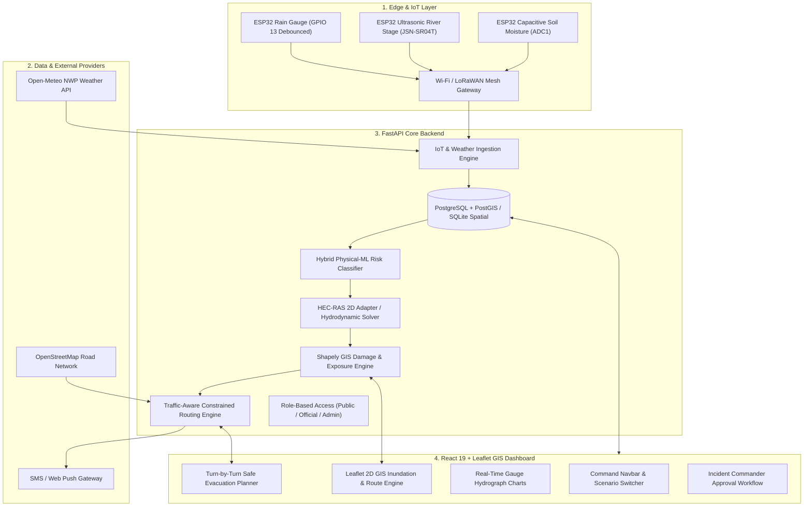
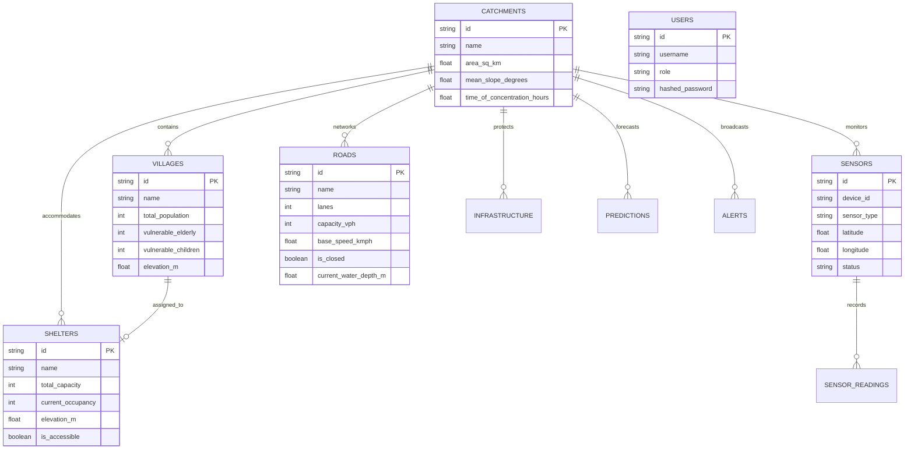

# TerraGuard NE: Intelligent Flash Flood Prediction, Downstream Impact Simulation and Smart Evacuation System

[](https://opensource.org/licenses/MIT)
[](https://fastapi.tiangolo.com)
[](https://react.dev)
[](https://leafletjs.com)
[](https://www.hec.usace.army.mil/software/hec-ras/)
[](https://espressif.com)

---

## 1. Executive Summary & Problem Statement

Flash floods in the steep, fragile terrain of the Eastern Himalayas and hilly regions of India (such as Arunachal Pradesh, Assam foothills, Uttarakhand, and Himachal Pradesh) pose severe threats to life and infrastructure. Characterized by brief times of concentration ($T_c < 2\text{--}4\text{ hours}$), rapid soil saturation, and narrow mountain gorges, torrential surges can inundate downstream riverine communities with virtually zero warning time.

**TerraGuard NE** is an end-to-end, full-stack disaster intelligence and tactical decision-support system. Built specifically for the **Dikrong River Catchment** (Papum Pare, Arunachal Pradesh to Lakhimpur, Assam), it connects edge IoT sensors to physics-guided machine learning risk prediction, 2D hydrodynamic simulation, demographic exposure assessment, and traffic-aware safe evacuation routing.

### Core Operational Cycle:
```
Predict → Monitor → Simulate → Assess Impact → Evacuate → Verify → Learn
```

---

## 2. Truth & Provenance Classification Standard

To ensure disaster management officers, incident commanders, and citizens are never misled by unverified model outputs, every piece of data rendered in the system carries an immutable provenance classification tag:

| Tag | Category | Description & Source |
| :--- | :--- | :--- |
| **`[OBSERVED]`** | Ground-Truth Telemetry | Physical measurements from ESP32 telemetry stations and CWC/IMD gauges. |
| **`[FORECAST]`** | Numerical Weather Prediction | Real-time atmospheric forecasts via Open-Meteo API (ECMWF/GFS). |
| **`[PREDICTED]`** | AI / Hydrological Model | Flash flood risk scores and lead-times calculated by the machine learning engine. |
| **`[SIMULATED]`** | Hydraulic 2D Solver | Inundation depths, velocities, and arrival times from HEC-RAS 2D hydrodynamic solver. |
| **`[OFFICIAL WARNING]`**| Signed Evacuation Order | Authorized, digitally approved emergency orders issued by SDMA / DDMA officers. |

---

## 3. System Architecture & Flowchart



---

## 4. Database Entity-Relationship Diagram



---

## 5. Mathematical & Engineering Foundations

### A. Manning's Open Channel Flow (River Stage & Velocity)
The cross-sectional stage-discharge relationship is computed along the Dikrong reach:
$$Q = \frac{1}{n} A R^{2/3} S_0^{1/2}$$
For wide rectangular mountain channels:
$$y = \left( \frac{Q \cdot n}{W \cdot S_0^{1/2}} \right)^{3/5}$$
- Manning's $n$: `0.038` (stony Himalayan gravel/cobble bed)
- Reach slope $S_0$: `0.012 - 0.024`
- Channel width $W$: `120m` (Doimukh) to `240m` (Harmuti-Bihpuria floodplain)

### B. Greenshields Macroscopic Traffic Density Model
Evacuation travel speeds dynamically scale with evacuee vehicular volume:
$$v = v_f \left( 1 - \frac{k}{k_j} \right)$$
Where $v_f$ is free-flow highway speed, $k$ is active evacuation density, and $k_j$ is jam density.

### C. Life-Safety Roadway Pruning Threshold
According to Indian Road Congress (IRC) and FEMA flood hazard guidelines:
- Water depth $> 0.30\text{ m}$ (12 inches) causes loss of vehicle steering traction and buoyant sweep.
- Any road segment with simulated depth $> 0.30\text{ m}$ or compromised bridges is **strictly pruned** from the evacuation routing graph.

---

## 6. Demonstration Scenarios

TerraGuard NE includes three preconfigured demonstration scenarios switchable live from the top navbar:

| Scenario | Tag | Rainfall | River Stage | Peak Q | Downstream Impact & Evacuation Action |
| :--- | :--- | :--- | :--- | :--- | :--- |
| **Scenario 1** | `NORMAL_CONDITIONS` | 4.2 mm/h | 3.10 m | 280 m³/s | Baseflow. All roads open. Normal operations. |
| **Scenario 2** | `RISING_FLOOD_RISK` | 38.5 mm/h | 6.90 m | 1,450 m³/s | Saturated soil (76.5%). Orange Watch advisory. Nirjuli low bank on standby. |
| **Scenario 3** | `FLASH_FLOOD_EMERGENCY` | 96.4 mm/h | 10.80 m | 3,480 m³/s | Cloudburst surge. Pichola right embankment breaches. Timber bridge cutoff. Level-3 Red Evacuation Order. |

---

## 7. Quickstart Installation Guide

### Option A: Local Zero-Setup Execution (Recommended for Demo & Hackathons)

TerraGuard NE is preconfigured to run locally with **zero external database dependencies** using SQLite with full spatial modeling:

#### 1. Backend Setup:
```bash
# Navigate to backend directory
cd backend

# Install dependencies
python -m pip install -r requirements.txt

# Run automated tests
python -m pytest tests/ -v

# Start FastAPI Server (Runs on http://localhost:8000)
python main.py
```

#### 2. Frontend Setup:
```bash
# In a separate terminal, navigate to frontend directory
cd frontend

# Install npm dependencies
npm install

# Start Vite Development Server (Runs on http://localhost:3000)
npm run dev
```

Visit **`http://localhost:3000`** in your browser to interact with the full disaster management dashboard!

---

### Option B: Production Deployment via Docker Compose

```bash
# From the root directory
docker compose up --build
```
Services spun up:
- **`web`**: Nginx + React 19 Frontend (`http://localhost:80`)
- **`api`**: FastAPI Python Backend (`http://localhost:8000`)
- **`db`**: PostgreSQL 15 with PostGIS 3.3 (`localhost:5432`)
- **`redis`**: Redis Cache & Async Message Broker (`localhost:6379`)

---

## 8. REST API Endpoints Reference

| Method | Endpoint | Description |
| :--- | :--- | :--- |
| `GET` | `/api/health` | System health check and catchment metadata |
| `GET` | `/api/catchments` | List river catchments |
| `GET` | `/api/catchments/{id}/boundary` | Catchment boundary GeoJSON |
| `GET` | `/api/catchments/{id}/river-network`| River channels and reach parameters GeoJSON |
| `GET` | `/api/catchments/{id}/villages` | Census-calibrated villages and demographic vulnerability |
| `GET` | `/api/sensors` | List IoT telemetry stations and live fleet health |
| `POST` | `/api/sensors/readings` | Ingest telemetry reading from ESP32 edge station |
| `GET` | `/api/weather/{catchment_id}` | Live weather and forecast from Open-Meteo API |
| `GET` | `/api/predictions/{id}/latest` | Latest flash flood risk assessment and lead time |
| `POST` | `/api/predictions/run` | Run AI flood risk prediction with custom sliders |
| `GET` | `/api/simulations/scenarios` | List demonstration scenarios |
| `POST` | `/api/simulations/switch-scenario`| Live switch active scenario |
| `POST` | `/api/simulations/run` | Launch asynchronous 2D hydraulic simulation job |
| `GET` | `/api/simulations/{id}` | Poll simulation job status and execution progress |
| `GET` | `/api/impact/{catchment_id}` | Downstream damage assessment and exposure breakdown |
| `POST` | `/api/evacuation/routes` | Safety-first, traffic-aware evacuation routes |
| `GET` | `/api/shelters` | High-ground safe shelters with real-time capacity |
| `GET` | `/api/alerts` | Active emergency warnings and broadcast history |
| `PUT` | `/api/alerts/{id}/approve` | Incident Commander approval and broadcast order |
| `POST` | `/api/reports` | Submit citizen ground-truth field report |
| `GET` | `/api/admin/system-health` | Adapter diagnostics and hardware inspection |

---

## 9. ESP32 Hardware Wiring & Pinouts

See [`iot_firmware/WIRING_AND_SETUP.md`](file:///iot_firmware/WIRING_AND_SETUP.md) for detailed assembly schematics:
- **Tipping Bucket Rain Gauge**: Reed switch connected to **GPIO 13** (Interrupt debounced).
- **JSN-SR04T Waterproof Ultrasonic**: Trig on **GPIO 5**, Echo on **GPIO 18** (5-point median ripple filter).
- **Capacitive Soil Moisture Sensor v1.2**: Analog output connected to **GPIO 34** (ADC1_CH6).
- **Battery Voltage Divider**: Midpoint connected to **GPIO 35** (ADC1_CH7).

---

## 10. Authors & Acknowledgments

Developed for regional disaster resilience in Northeast India and academic engineering hackathons. Built with open-source technologies by senior full-stack and environmental engineering specialists.
