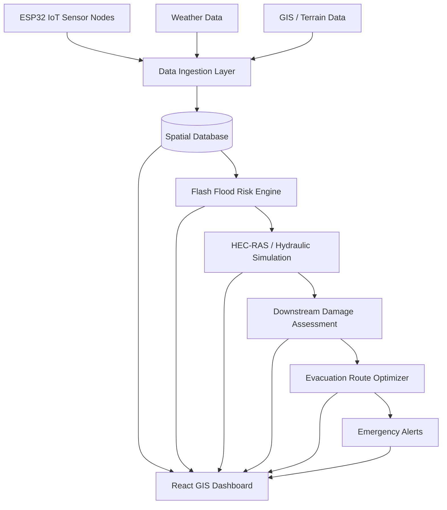

# 🌊 HydroGuard

### Intelligent Flash Flood Prediction • Downstream Impact Simulation • Smart Evacuation

> **HydroGuard** is an end-to-end disaster intelligence platform
> designed for hyper-local flash-flood risk monitoring in hilly and
> mountainous regions of India.

The system combines **IoT telemetry, weather data, hydrological
modelling, GIS, 2D flood simulation, population exposure analysis,
traffic-aware evacuation routing, and emergency alerts** into a single
operational platform.

------------------------------------------------------------------------

## 🚨 The Problem

Flash floods in hilly regions can develop extremely quickly. Rainfall
alone does not describe the complete hazard. Risk also depends on soil
saturation, river stage, terrain, downstream exposure, road
accessibility, bridges, shelters, and evacuation traffic.

HydroGuard connects these factors:

``` text
OBSERVE → MONITOR → PREDICT → SIMULATE → ASSESS IMPACT
                                      ↓
                         PLAN EVACUATION → ALERT
                                      ↓
                              VERIFY → LEARN
```

## 🎯 Project Objective

> **Move from simply asking "How much rain will fall?" to asking "Can
> the terrain and drainage system safely handle the incoming water?"**

HydroGuard provides:

-   Hyper-local flood-risk assessment
-   Early warning lead-time estimation
-   Real-time environmental monitoring
-   Flood inundation modelling
-   Downstream impact assessment
-   Population exposure estimation
-   Safe evacuation route planning
-   Traffic-aware routing
-   Emergency notification workflows
-   GIS-based situational awareness

------------------------------------------------------------------------

## 🗺️ Current Demonstration Area

**Dikrong River Catchment**\
Papum Pare, Arunachal Pradesh → Lakhimpur, Assam\
Eastern Himalayan foothills

The current implementation contains GIS datasets for the catchment
boundary, river network, villages, infrastructure, roads, shelters, and
demonstration scenarios.

> The architecture is designed to expand to other vulnerable hilly
> catchments.

------------------------------------------------------------------------

## 🖼️ Dashboard Preview

Add your dashboard screenshot/GIF here:

``` markdown

```

------------------------------------------------------------------------

## 🏷️ Project Badges


------------------------------------------------------------------------

# 🧠 System Architecture



------------------------------------------------------------------------

# 🏗️ Technology Stack

### Frontend

-   React 19
-   TypeScript
-   Vite
-   Tailwind CSS
-   Leaflet
-   Recharts
-   Lucide React

### Backend

-   Python
-   FastAPI
-   SQLAlchemy
-   Pydantic
-   SQLite / PostgreSQL
-   PostGIS
-   Redis

### GIS & Hydrology

-   Leaflet GIS
-   GeoJSON
-   Shapely
-   HEC-RAS 2D
-   OpenStreetMap

### Environmental Data

-   Open-Meteo
-   IoT sensor telemetry
-   River-stage measurements
-   Soil-moisture measurements
-   Rainfall measurements

### Hardware

-   ESP32
-   Tipping-bucket rain gauge
-   JSN-SR04T ultrasonic river-stage sensor
-   Capacitive soil-moisture sensor
-   Battery-voltage monitoring

------------------------------------------------------------------------

# ✅ What Has Already Been Built

## 1. 🖥️ Command & Control Dashboard

A React operational dashboard with 10 command pages:

-   Landing / project overview
-   Main disaster dashboard
-   Live monitoring
-   Flood prediction
-   Flood simulation
-   Downstream damage assessment
-   Evacuation planning
-   Emergency alerts
-   Administration console
-   Project/scientific information

------------------------------------------------------------------------

## 2. 🗺️ Interactive GIS Map

Leaflet-based map layers include:

-   Catchment boundary
-   River network
-   Villages
-   Sensors
-   Shelters
-   Roads
-   Flooded/inundated areas
-   Evacuation routes

------------------------------------------------------------------------

## 3. 🌧️ IoT Environmental Monitoring

ESP32 telemetry currently supports:

  Sensor                      Purpose           Interface
  --------------------------- ----------------- ------------------
  Tipping Bucket Rain Gauge   Rainfall          GPIO 13
  JSN-SR04T                   River Stage       GPIO 5 / GPIO 18
  Capacitive Soil Moisture    Soil Saturation   GPIO 34
  Battery Monitor             Node Power        GPIO 35

Firmware includes:

-   Interrupt-based rainfall measurement
-   Debouncing
-   Median filtering
-   Hardware watchdog
-   Offline data buffering
-   SPIFFS circular storage
-   Calibration parameters

The offline buffer supports up to 500 readings.

------------------------------------------------------------------------

## 4. 🌦️ Weather Integration

The backend integrates Open-Meteo weather information.

HydroGuard explicitly labels information as:

``` text
[OBSERVED]
[FORECAST]
[PREDICTED]
[SIMULATED]
[OFFICIAL WARNING]
```

This separates physical measurements, forecasts, model outputs,
simulations, and authorized warnings.

------------------------------------------------------------------------

# 🧮 5. Flash Flood Prediction Engine

The hybrid physical/ML risk engine considers:

-   Rainfall intensity
-   Rainfall accumulation
-   Soil saturation
-   River stage
-   Rate of river rise
-   Catchment characteristics
-   Hydrological thresholds

Outputs include:

-   Continuous risk score
-   Risk category
-   Estimated warning lead time
-   Feature/explanation breakdown

------------------------------------------------------------------------

# 🌊 6. Hydrological Modelling

The project incorporates Manning's open-channel flow equation:

``` text
Q = (1/n) A R^(2/3) S₀^(1/2)
```

Current modelling parameters include channel roughness, slope, width,
river stage, and flow velocity.

------------------------------------------------------------------------

# 🌊 7. HEC-RAS 2D Hydraulic Flood Simulation

HydroGuard integrates a complete **2D hydraulic modeling component** based on USACE HEC-RAS 2D Shallow Water Equations (SWE) and 2D Diffusion Wave formulations:

-   **Dual-Mode Execution**:
    -   *Native HEC-RAS 6.x*: Automatically generates `.prj`, `.p01`, `.u01`, `.g01` project inputs, executes unsteady computations, and parses binary HDF5 output (`.p01.hdf`).
    -   *Calibrated 2D Hydrodynamic Fallback*: Self-contained Python/Shapely hydrodynamic solver calibrated to the Dikrong basin geometry when HEC-RAS is not installed locally.
-   **Outputs Produced**:
    -   2D Water Depth ($h$) & Water Surface Elevation (WSE)
    -   Flow Velocity field ($v$) & directional vector components $(u, v)$
    -   Wave Celerity ($c = \frac{5}{3}v$) & time-of-arrival ($t_{arr}$)
    -   Froude Number ($Fr$) & Defra / USACE Flood Hazard Index ($HR = d \cdot (v+0.5) + DF$)
    -   Multi-timestep unsteady wave propagation ($T+0.5h \to T+6.0h$)
    -   GeoJSON 2D Inundation depth bands and velocity vectors
-   **Downstream Pipeline**: Direct synchronization with downstream village exposure, severed bridges, road submergence cutoff ($>0.30m$), and life-safety evacuation routing.
-   **Project Export**: Direct export and download of USACE HEC-RAS 6.x project files for desktop analysis.

For complete mathematical formulation and API references, see the [HEC-RAS 2D Technical Guide](docs/HECRAS_2D_GUIDE.md).

------------------------------------------------------------------------

# 🏘️ 8. Downstream Damage & Exposure

The GIS damage engine identifies potentially affected:

-   Villages
-   Roads
-   Infrastructure
-   Population
-   Other mapped assets

Pipeline:

``` text
Flood Simulation
      ↓
Inundation Polygon
      ↓
Spatial Intersection
      ↓
Affected Assets
      ↓
Population Exposure
      ↓
Road Cutoffs
```

Shapely is used for spatial analysis.

------------------------------------------------------------------------

# 🚗 9. Smart Evacuation Routing

The routing engine considers:

-   Flood depth
-   Road accessibility
-   Bridge condition
-   Road connectivity
-   Traffic congestion
-   Shelter capacity
-   Travel time

Unsafe road segments are removed from the routing graph.

The current implementation uses a Dijkstra-based road graph and
Greenshields traffic-density model:

``` text
v(k) = v_f (1 - k/k_j)
```

------------------------------------------------------------------------

# 🚨 10. Emergency Alert System

Current functionality includes:

-   SMS simulation
-   Web push simulation
-   Official alert approval
-   Incident Commander workflow
-   Citizen reports
-   Emergency order tracking

Automated predictions are separated from officially authorized emergency
warnings.

------------------------------------------------------------------------

# 🏛️ 11. Role-Based Administration

Administrative functionality includes:

-   System health
-   Sensor fleet health
-   Adapter status
-   Database metrics
-   Hardware diagnostics
-   Audit information

The backend includes password hashing, JWT authentication, and RBAC.

------------------------------------------------------------------------

# 🎛️ 12. Demonstration Scenarios

  -------------------------------------------------------------------------------------
  Scenario    Tag                              Rainfall     River Stage          Peak Q
  ----------- ------------------------- --------------- --------------- ---------------
  🟢 Normal   `NORMAL_CONDITIONS`              4.2 mm/h          3.10 m        280 m³/s

  🟠 Rising   `RISING_FLOOD_RISK`             38.5 mm/h          6.90 m      1,450 m³/s
  Risk                                                                  

  🔴          `FLASH_FLOOD_EMERGENCY`         96.4 mm/h         10.80 m      3,480 m³/s
  Emergency                                                             
  -------------------------------------------------------------------------------------

These scenarios demonstrate the transition from normal conditions to a
critical flood emergency.

------------------------------------------------------------------------

# 🧪 13. Automated Testing

The documented backend test suite currently reports:

``` text
10 tests
10 passed
0 failed
```

It covers:

-   Health
-   Catchments
-   Sensor telemetry and health
-   Weather integration
-   Flood prediction
-   Simulation and scenario switching
-   Damage assessment
-   Evacuation routing
-   Shelters and alerts
-   Administration

Run:

``` bash
python -m pytest tests/ -v
```

------------------------------------------------------------------------

# 🐳 14. Docker Deployment

Included:

-   Backend Dockerfile
-   Frontend Dockerfile
-   Docker Compose
-   PostgreSQL/PostGIS configuration
-   Redis configuration
-   Production frontend build
-   Nginx reverse proxy

------------------------------------------------------------------------

# 📁 Project Structure

``` text
hydroguard/
│
├── start.py
│
├── backend/
│   ├── app/
│   │   ├── api/
│   │   ├── core/
│   │   ├── models/
│   │   ├── schemas/
│   │   ├── services/
│   │   └── data/
│   ├── tests/
│   ├── main.py
│   ├── requirements.txt
│   └── Dockerfile
│
├── frontend/
│   ├── src/
│   │   ├── components/
│   │   ├── pages/
│   │   ├── services/
│   │   └── types/
│   ├── package.json
│   └── Dockerfile
│
├── iot_firmware/
│   ├── esp32_hydroguard_node/
│   │   ├── esp32_hydroguard_node.ino
│   │   └── config.h
│   └── WIRING_AND_SETUP.md
│
├── docs/
│   └── images/
│
├── docker-compose.yml
└── README.md
```

------------------------------------------------------------------------

# 🔬 Scientific & Engineering Approach

``` text
                 ENVIRONMENT
                     │
        ┌────────────┼────────────┐
        ↓            ↓            ↓
     Rainfall    Soil Moisture   River Stage
        │            │            │
        └────────────┼────────────┘
                     ↓
              RISK ASSESSMENT
                     ↓
             HYDRAULIC MODEL
                     ↓
            FLOOD INUNDATION
                     ↓
             DAMAGE ANALYSIS
                     ↓
          POPULATION EXPOSURE
                     ↓
          SAFE ROUTE OPTIMIZER
                     ↓
              ALERT SYSTEM
                     ↓
               EVACUATION
```

------------------------------------------------------------------------

# 🚧 Roadmap

## Phase 1 --- Real Field Deployment

-   [ ] Deploy ESP32 sensor nodes in real catchments
-   [ ] Connect real tipping-bucket rain gauges
-   [ ] Deploy river-stage stations
-   [ ] Deploy soil-moisture stations
-   [ ] Reliable long-range communication
-   [ ] LoRa / LoRaWAN mesh
-   [ ] GSM emergency communication
-   [ ] Solar/battery-powered field operation

## Phase 2 --- Multi-Catchment Expansion

``` text
Dikrong
   ↓
Arunachal Pradesh
   ↓
Northeast India
   ↓
Hilly & Mountainous Regions of India
```

-   [ ] Multi-catchment configuration
-   [ ] Automatic catchment selection
-   [ ] Regional hazard dashboard
-   [ ] Catchment-specific model calibration

## Phase 3 --- Advanced Flood Prediction

-   [ ] Train ML models using historical flood events
-   [ ] Larger historical rainfall datasets
-   [ ] Historical flood inventories
-   [ ] More soil-moisture observations
-   [ ] Catchment-specific calibration
-   [ ] Prediction uncertainty estimates
-   [ ] Improved warning lead-time prediction
-   [ ] Historical-event validation

## Phase 4 --- Advanced Hydrodynamic Simulation

-   [ ] Production HEC-RAS workflows
-   [ ] Automated model generation/configuration
-   [ ] Higher-resolution terrain
-   [ ] DEM-derived elevation
-   [ ] Improved river cross-sections
-   [ ] Multiple breach scenarios
-   [ ] Flood arrival-time maps
-   [ ] Depth and velocity maps

## Phase 5 --- Satellite & Remote Sensing

-   [ ] Satellite imagery
-   [ ] DEM/elevation
-   [ ] Land-cover data
-   [ ] Terrain slope
-   [ ] Drainage networks
-   [ ] Historical landslide/flood inventories
-   [ ] Land-use change analysis

## Phase 6 --- Smarter Evacuation

-   [ ] Real-time traffic data
-   [ ] Dynamic road closures
-   [ ] Detailed bridge vulnerability
-   [ ] Shelter capacity optimization
-   [ ] Multi-shelter allocation
-   [ ] Crowd-aware evacuation
-   [ ] Emergency vehicle prioritization
-   [ ] Offline evacuation maps
-   [ ] Mobile citizen navigation

## Phase 7 --- Community & Citizen Reporting

-   [ ] Flood-depth reports
-   [ ] Road-blockage reports
-   [ ] Bridge-damage reports
-   [ ] Infrastructure-damage reports
-   [ ] Unsafe-location reports
-   [ ] Field photographs
-   [ ] Emergency reports
-   [ ] Ground-truth verification layer

------------------------------------------------------------------------

# 🔄 Long-Term Vision

HydroGuard follows a closed-loop disaster intelligence architecture:

``` text
       ┌───────────────┐
       │    PREDICT    │
       └───────┬───────┘
               ↓
       ┌───────────────┐
       │    MONITOR    │
       └───────┬───────┘
               ↓
       ┌───────────────┐
       │    VERIFY     │
       └───────┬───────┘
               ↓
       ┌───────────────┐
       │     LEARN     │
       └───────┬───────┘
               │
               └──────────────→ PREDICT
```

The long-term goal is a system that continuously:

**observes → predicts → simulates → verifies → learns → responds.**

------------------------------------------------------------------------

# ⚠️ Disclaimer

HydroGuard is an engineering and research prototype.

Predictions, simulations, estimated exposure values, and evacuation
routes should not be treated as official emergency instructions unless
validated and authorized by the appropriate disaster-management
authorities.

The system explicitly distinguishes observed, forecast, predicted,
simulated, and officially authorized information.

------------------------------------------------------------------------

# 🚀 Running Locally

## Prerequisites

-   Python 3.13
-   Node.js / npm
-   Git
-   Optional: Docker Desktop

## Backend

``` bash
cd backend
python -m venv .venv
```

### Windows

``` powershell
.venv\Scripts\activate
```

### macOS / Linux

``` bash
source .venv/bin/activate
```

Install dependencies:

``` bash
pip install -r requirements.txt
```

Start:

``` bash
python main.py
```

Backend:

``` text
http://localhost:8000
```

Swagger:

``` text
http://localhost:8000/docs
```

## Frontend

Open another terminal:

``` bash
cd frontend
npm install
npm run dev
```

Frontend:

``` text
http://localhost:3000
```

------------------------------------------------------------------------

# 🐳 Docker

From the project root:

``` bash
docker compose up --build
```

Stop:

``` bash
docker compose down
```

------------------------------------------------------------------------

# 🌐 Core API Modules

``` text
/auth
/catchments
/sensors
/weather
/predictions
/simulations
/damage
/evacuation
/shelters
/alerts
/reports
/admin
```

------------------------------------------------------------------------

# 📊 Feature Status

  Capability                          Status
  ----------------------------------- ------------
  React GIS Dashboard                 ✅ Built
  FastAPI Backend                     ✅ Built
  Interactive GIS                     ✅ Built
  ESP32 Telemetry                     ✅ Built
  Rainfall Monitoring                 ✅ Built
  River Stage Monitoring              ✅ Built
  Soil Moisture Monitoring            ✅ Built
  Weather Integration                 ✅ Built
  Flood Risk Engine                   ✅ Built
  Hydraulic Simulation Adapter        ✅ Built
  Downstream Damage Analysis          ✅ Built
  Population Exposure                 ✅ Built
  Safe Evacuation Routing             ✅ Built
  Traffic-Aware Routing               ✅ Built
  Emergency Alert Workflow            ✅ Built
  Scenario Simulation                 ✅ Built
  Admin Console                       ✅ Built
  Automated Tests                     ✅ Built
  Docker Deployment                   ✅ Built
  Multi-Catchment Deployment          🚧 Planned
  Large-Scale ML Training             🚧 Planned
  Real-Time Traffic Integration       🚧 Planned
  Large-Scale Satellite Integration   🚧 Planned
  Full Field Deployment               🚧 Planned
  Citizen Mobile Application          🚧 Planned

------------------------------------------------------------------------

# 🏆 Why HydroGuard?

Many disaster-management systems focus on only one stage of the disaster
chain.

HydroGuard attempts to connect the entire chain:

``` text
SENSORS
   ↓
WEATHER
   ↓
RISK
   ↓
HYDROLOGY
   ↓
FLOOD SIMULATION
   ↓
DAMAGE
   ↓
POPULATION
   ↓
ROADS
   ↓
TRAFFIC
   ↓
EVACUATION
   ↓
ALERTS
```

This creates a unified operational picture instead of treating flood
prediction, impact assessment, and evacuation as isolated systems.

------------------------------------------------------------------------

# 🔌 Core Services

``` text
IoT Telemetry
     │
     ├── Rainfall
     ├── River Stage
     ├── Soil Moisture
     └── Battery
          │
          ↓
     Data Ingestion
          │
          ↓
      Risk Engine
          │
          ├───────────────┐
          ↓               ↓
    HEC-RAS 2D       Weather Data
          │
          ↓
   Flood Inundation
          │
          ↓
    Damage Engine
          │
          ↓
 Population Exposure
          │
          ↓
 Evacuation Engine
          │
          ↓
 Emergency Alerts
```

------------------------------------------------------------------------

# 🤝 Contributing

Contributions, ideas, bug reports, and research collaboration are
welcome.

``` bash
git clone <repository-url>
cd hydroguard

git checkout -b feature/your-feature

git add .
git commit -m "feat: add your feature"

git push origin feature/your-feature
```

Then open a Pull Request.

------------------------------------------------------------------------

# 📄 License

Add your preferred open-source license here.

Example:

``` text
MIT License
```

------------------------------------------------------------------------

# 💙 HydroGuard

### Turning environmental data into actionable disaster intelligence.

**Predict → Monitor → Verify → Learn**
